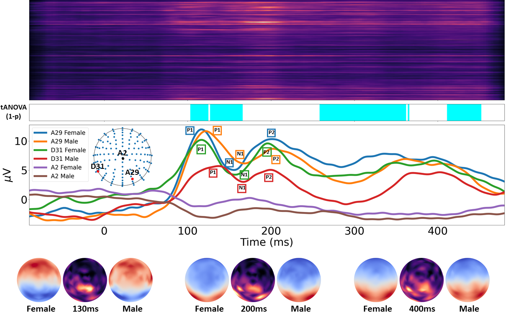

# Machine-Learning-Project
Project for CS-433 Machine Learning @ EPFL: Probing EEG Signals with Neural-Network Classifiers

<p align="center"></p>

This is the repository for our ML Project 2 - Probing EEG Signals with Neural-Network Classifiers.

## Table of Contents

- [Overview](#overview)
- [Prerequisites](#prerequisites)
- [Getting Started](#getting-started)
  - [Data](#data)
  - [Training](#training)
  - [Testing](#testing)
  - [Visualization](#visualization)
  - [Statistic Analysis](#statistic-analysis)
- [Contact](#contact)

## Overview

We consider investigating the effect of gender in word production by classifying Electroencephalography (EEG) brain signals. The EEG signals are analyzed using various models. To understand the disparity of brain activities between female and male, we propose a gradient-based method to indicate the brain regions and time periods exhibiting dominant differences in the picture naming task, which helps us reveal dynamic changes of brain in a more accurate and easier fashion.

You can find the codes here for gender classification on EEG data and for significance visualization of signal dissimilarities. We implement 4 models, including a linear model (LIN), a multilayer perceptron (MLP), a recurrent model (GRU) and a convolutional model (CNN).

## Prerequisites

- Python 3.7
- pandas 1.3.5
- openpyxl 3.0.9
- numpy 1.21.4
- collection
- matplotlib 3.5.1
- scipy 1.7.3
- PyTorch 1.10.0+cu102 
- imageio 2.13.3
- opencv 4.5.4

Usually, other versions also work. To install, you can run

```
pip install pandas openpyxl numpy collection matplotlib scipy torch imageio opencv-python
```

## Getting Started

### Data

Before running the code, you need to download the dataset from [EEG_dataset.pth](https://drive.google.com/file/d/1zQi72b9_j1zbEUPtQorYEv29_3OLVOe6/view?usp=sharing) and [EEG_dataset_by_subject.pth](https://drive.google.com/file/d/1Y5UCXA82ko64fAdmeH0Kn4C2-EN-tVJJ/view?usp=sharing) and put them under `./data/training_data`. Our pretrained models are already included in this repository and you can find them from `./checkpoints`. 

(The raw data is processed by the script `data_preparation.py` to generate these .pth files, but we don't provide the raw data because of principle of confidentiality. We also have filtered data in different frequency bands. Since they take a huge amount of storage, we don't provide them here.)

The difference between `EEG_dataset.pth` and `EEG_dataset_by_subject.pth` is the way how we create the folds for cross validation. EEG_dataset.pth is used for training/testing on the data from the same distribution, while EEG_dataset_by_subject.pth is used for training/testing on the data from different distribution (cross-subject evaluation) which is harder. See Sec. B of the Appendices in our paper for more descriptions of the two different settings.

After downloading, you should have necessary data files organized in the following way:

```
./data
|--behavioral_info.xlsx
|--Biosemi128OK.xyz 
|--xyz.npy
|--training_data
   |--EEG_dataset.pth
   |--splits.pth
   |--EEG_dataset_by_subject.pth
   |--splits_by_subject.pth

./checkpoints
|--LIN
   |--random
      |--LIN_split_X_best.pth
   |--by-subject
      |--LIN_split_X_best.pth
|--MLP
   |--random
      |--MLP_split_X_best.pth
   |--by-subject
      |--MLP_split_X_best.pth
|--GRU
   |--random
      |--GRU_split_X_best.pth
   |--by-subject
      |--GRU_split_X_best.pth
|--CNN
   |--random
      |--CNN_split_X_best.pth
   |--by-subject
      |--CNN_split_X_best.pth
```

### Training

To train the classifier on `./data/training_data/EEG_dataset.pth` and `./data/training_data/EEG_dataset_by_subject.pth`, run the following lines respectively.

```
python  main.py --classifier CLASSIFIER_NAME --train_mode full --split_num SPLIT_NUMBER --eeg_dataset ./data/training_data/EEG_dataset.pth --splits_path ./data/training_data/splits.pth --save_model 
python  main.py --classifier CLASSIFIER_NAME --train_mode full --split_num SPLIT_NUMBER --eeg_dataset ./data/training_data/EEG_dataset_by_subject.pth --splits_path ./data/training_data/splits_by_subject.pth --save_model 
```

**CLASSIFIER_NAME** should be `LIN`, `MLP`, `GRU` or `CNN` and **SPLIT_NUMBER** should be from `0` to `4`, which is corresponding to different folds.

The default optimizer is Adam optimizer, the learning rate is 0.001, the batch size is 128, and the number of epoch is 100 (but you can change them by setting command-line arguments). If you do not want to save the trained model, drop **--save_model** (the test accuracy will be printed on the screen anyway). Otherwise, the trained model will be saved at `./checkpoints` automatically and named in the format as `CNN_split_X_best.pth`. For more information about options, check `./lib/options.py`. If you don't have GPU, add **--no_cuda**.

### Testing

To test the classifier, run

```
python  eval.py --classifier CLASSIFIER_NAME --train_mode full --load_path PATH_TO_CHECKPOINTS --eeg_dataset PATH_TO_EEG_DATA --splits_path PATH_TO_SPLIT_FILE
```

The script will load models trained on different folds from **PATH_TO_CHECKPOINTS**  for the evaluation on test set. The test accuracy will be shown on the screen.

For example, if you want to use our pretrained LIN/MLP/GRU/CNN models for evaluation, you can run

```
python  eval.py --classifier LIN --train_mode full --load_path ./checkpoints/LIN/random --eeg_dataset ./data/training_data/EEG_dataset.pth --splits_path ./data/training_data/splits.pth
python  eval.py --classifier LIN --train_mode full --load_path ./checkpoints/LIN/by-subject --eeg_dataset ./data/training_data/EEG_dataset_by_subject.pth --splits_path ./data/training_data/splits_by_subject.pth

python  eval.py --classifier MLP --train_mode full --load_path ./checkpoints/MLP/random --eeg_dataset ./data/training_data/EEG_dataset.pth --splits_path ./data/training_data/splits.pth
python  eval.py --classifier MLP --train_mode full --load_path ./checkpoints/MLP/by-subject --eeg_dataset ./data/training_data/EEG_dataset_by_subject.pth --splits_path ./data/training_data/splits_by_subject.pth

python  eval.py --classifier GRU --train_mode full --load_path ./checkpoints/GRU/random --eeg_dataset ./data/training_data/EEG_dataset.pth --splits_path ./data/training_data/splits.pth
python  eval.py --classifier GRU --train_mode full --load_path ./checkpoints/GRU/by-subject --eeg_dataset ./data/training_data/EEG_dataset_by_subject.pth --splits_path ./data/training_data/splits_by_subject.pth

python  eval.py --classifier CNN --train_mode full --load_path ./checkpoints/CNN/random --eeg_dataset ./data/training_data/EEG_dataset.pth --splits_path ./data/training_data/splits.pth
python  eval.py --classifier CNN --train_mode full --load_path ./checkpoints/CNN/by-subject --eeg_dataset ./data/training_data/EEG_dataset_by_subject.pth --splits_path ./data/training_data/splits_by_subject.pth
```

The models in `./checkpoints/XXX/random` and `./checkpoints/XXX/by-subject` are trained on `./data/training_data/EEG_dataset.pth` and `./data/training_data/EEG_dataset_by_subject.pth` respectively. After the evaluation of our pretrained models, you should get the following results as reported in our paper.

<table>
<tr><th>EEG_dataset </th><th>EEG_dataset_by_subject</th></tr>
<tr><td>


| Model |  LIN  |  MLP  |  GRU  |  CNN  |
| :---: | :---: | :---: | :---: | :---: |
|  ACC  | 76.0% | 80.1% | 85.4% | 90.0% |

</td><td>

| Model |  LIN  |  MLP  |  GRU  |  CNN  |
| :---: | :---: | :---: | :---: | :---: |
|  ACC  | 55.5% | 53.5% | 62.4% | 66.3% |

</td></tr> </table>


### Visualization

To generate the significance map that indicates in which channels and time periods the signals of female and male have dissimilarities, run

```
python generate_guided_backprop.py --load_path checkpoints/CNN/random --gif 
```

This will give you the following figure and gif. If you do not want to generate gif as it will take a lot of time, drop **--gif**. The left and right images in the gif are 
the temporal amplitude changes of female's and male's signals. In the middle is our corresponding significance map.
